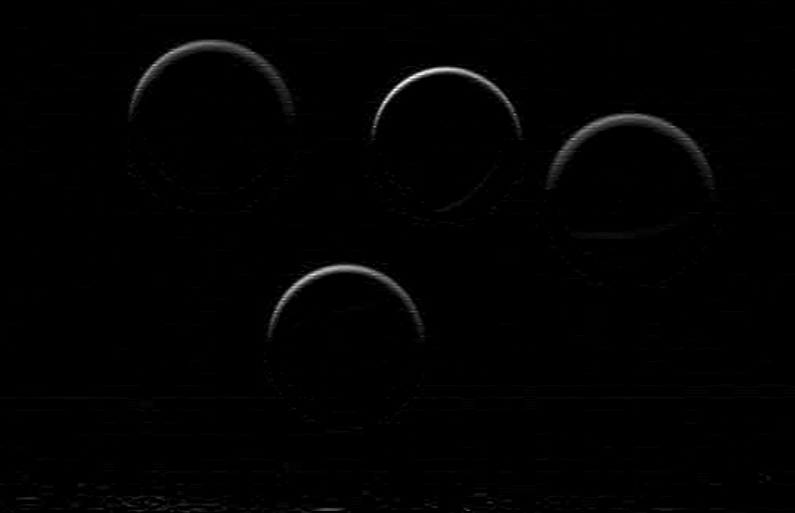
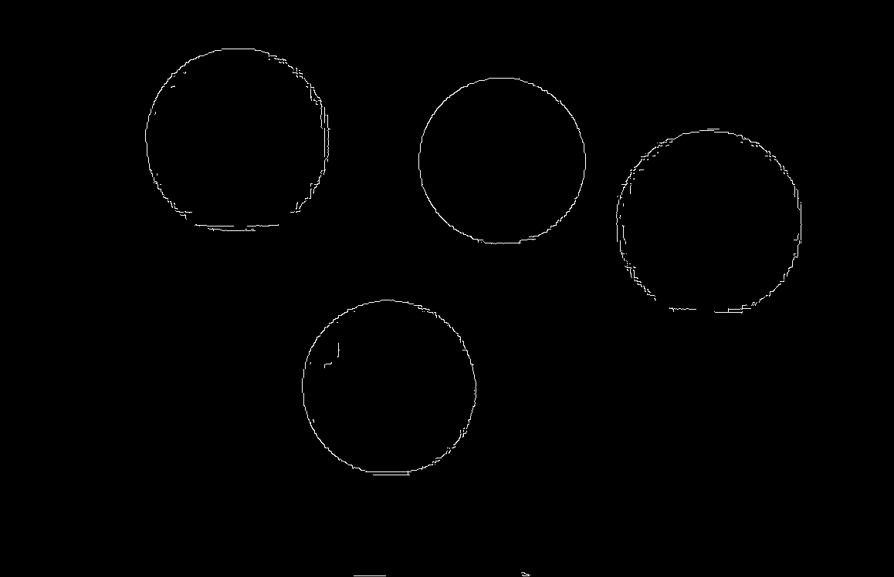
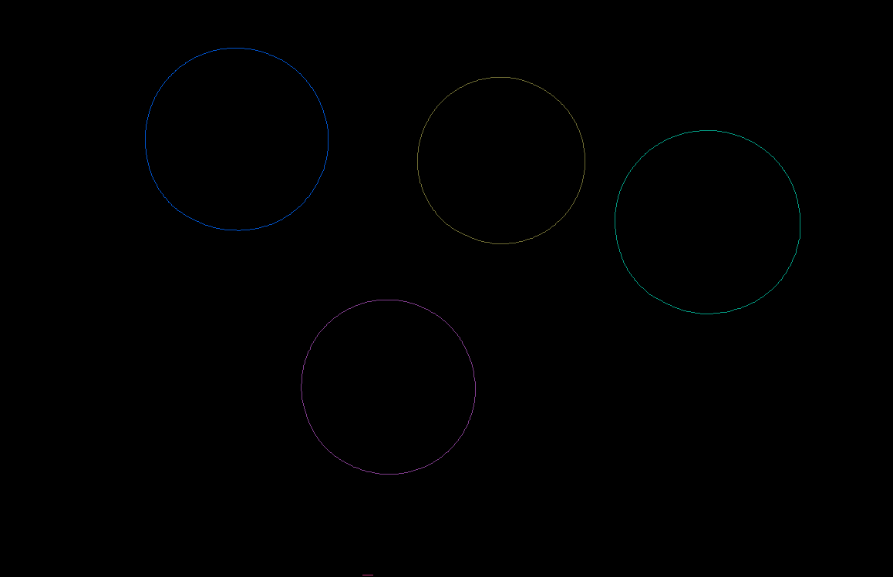

# Лабораторна робота №11. Виділення контурів на зображенні
### Мета роботи
Навчитись використовувати засоби OpenCV для виділення контурів на зображенні.
### Теоретичні відомості
Контур зображення характеризує форму, по контуру можна визначити тип обєкту.За допомогою контура можна точно оцінити розміри об’єкта, його поворот і розташування. Це важливо в автоматизації, робототехніці, тощо. Для знаходження контурів існує багато алгоритмів, розглянемо декілька з них.

Фільтр Собела здійснює гаусівське згладжування і взяття похідних 1- го та 2-го порядку по х та по у. Він має один недолік: працює на рівні окремих пікселів, тому отримані контури не є неперервними лініями. Для вирішення цих проблем використовують алгоритм Канні.

Алгоритм Канні є багатоетапним алгоритмом, включає в себе підкреслення точок фільтра Собела і їхню векторизацію.
Використовує 2 порогові обробки.
Ідея – трасувати контур, рухаючись по точкам з максимальним значенням «контура»
На виході отримуємо бінарну картинку зі знайденими пікселями, що відповідають контуру.
### Код програми з поясненнями

Метод `Sobel` знаходить точки контуру за допомогою методу Собела
```javascript
cv.cvtColor(src, dst, cv.COLOR_RGB2GRAY, 0);
cv.Sobel(dst, dst, cv.CV_8U, 0, 1, 3, 1, 0, cv.BORDER_DEFAULT);
```


Метод `Canny` знаходить точки контуру за допомогою методу Канні
```javascript
cv.cvtColor(src, dst, cv.COLOR_RGBA2GRAY, 0);
cv.Canny(src, dst, 50, 100, 3, false);
```


Також контур можна знайти за допомогою методу `findContours`. Попередньо маніпулюємо зображенням для кращого результату
```javascript
cv.cvtColor(src, filled, cv.COLOR_RGBA2GRAY, 0);
cv.threshold(filled, filled, 50, 200, cv.THRESH_BINARY);

cv.findContours(filled, contours, hierarchy, cv.RETR_CCOMP, cv.CHAIN_APPROX_SIMPLE);
```


###Висновки
Отже, на даній лабораторній роботі ми навчилися виділяти контури на зображенні за допомогою різних методів, зокрема Собела та Кенні.
