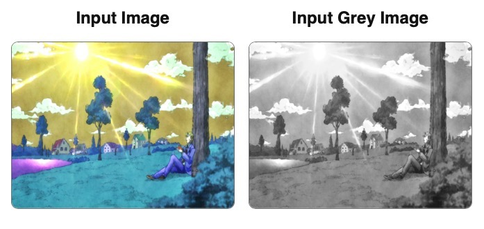
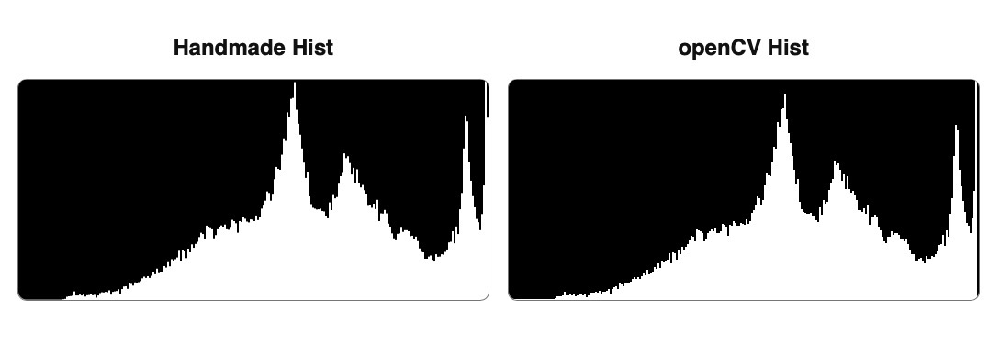
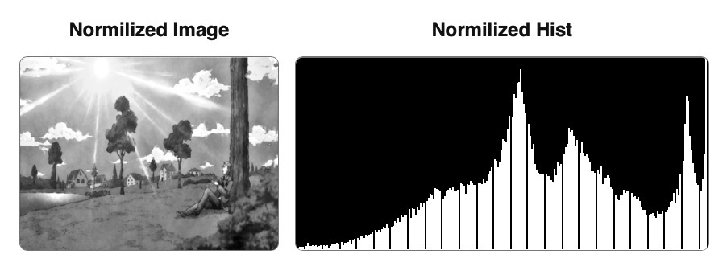
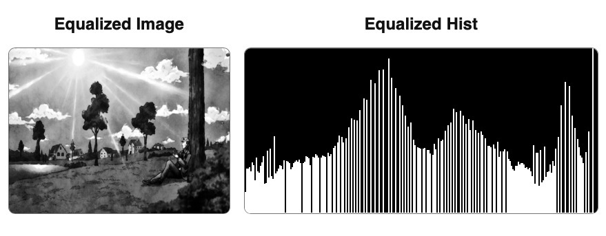

# Лабораторна робота №8. Гістограма зображення
### Мета роботи
Навчитись виконувати створювати додатки з найпростішими перетвореннями зображення.

### Теоретичні відомості

За допомогою нормалізації зображення стане більш яскравим, оскільки відстань між сусідніми областями яскравості збільшиться.

Метою еквалізації є таке перетворення, щоб гістограма яскравості максимально близько відповідала рівномірному закону розподілення, тобто вихідне зображення повинно містити однакову кількість пікселів для кожного значення яскравості.

### Код програми з поясненнями

Спочатку отримуємо дані про зображення з канваса, та перетворюємо його в 8-бітове зображення
```javascript
const src = cv.imread('inputCanvas');
cv.cvtColor(src, src, cv.COLOR_RGBA2GRAY, 0);
cv.imshow('inputGreyCanvas', src);
```


Потім ініціалізуємо змінні, необхідні для роботи з бібліотекою opencv.js
```javascript
let srcVec = new cv.MatVector();
srcVec.push_back(src);
let accumulate = false;
let channels = [0];
let histSize = [256];
let ranges = [0, 255];
let hist = new cv.Mat();
let mask = new cv.Mat();
let none = new cv.Mat();
let scale = 2;
```

Побудова гістограми відбувається за допомогою методу `cv.calcHist`
```javascript
cv.calcHist(srcVec, channels, mask, hist, histSize, ranges, accumulate);
drawHist(src, hist, histSize, mask, 'histCanvas', scale);
drawHandmadeHist(src, 'handmadeHistCanvas', scale);
```

Ітеруємо результуючу гістограму `hist` для її візуального представлення в канвасі
```javascript
function drawHist(src, hist, histSize, mask, canvasId, scale=1) {
  const color = new cv.Scalar(255, 255, 255);
  let result = cv.minMaxLoc(hist, mask);
  let max = result.maxVal;
  let dst = new cv.Mat.zeros(src.rows, histSize[0] * scale, cv.CV_8UC3);

  for (let i = 0; i < histSize[0]; i++) {
    let binVal = hist.data32F[i] * src.rows / max;
    let point1 = new cv.Point(i * scale, src.rows - 1);
    let point2 = new cv.Point((i + 1) * scale - 1, src.rows - binVal);
    cv.rectangle(dst, point1, point2, color, cv.FILLED);
  }

  cv.imshow(canvasId, dst);

  dst.delete();
}
```
Для ручної побудови діаграми, рахуємо кількість пікселів відповідної яскравості, потім також ітеруємо для зображення гістограми в канвасі
```javascript
function drawHandmadeHist(src, outputCanvasId, scale=1) {
  const hist = new Array(256);

  for(let i = 0; i< src.rows; i++) {
    for(let j = 0; j< src.cols; j++) {
      const k = src.ucharPtr(i, j)[0];
      hist[k] = (hist[k] || 0) + 1;
    }
  }

  const output = document.getElementById(outputCanvasId);
  output.width = scale * 256;
  const ctx = output.getContext('2d');
  const pixelsInCanvas = src.rows * src.cols;
  const arr = hist.map((el) => 1 - (75 * el / pixelsInCanvas));

  for (let i = 0; i <= 256; i++) {
    ctx.fillRect(i * scale, 0, scale, (output.height * arr[i]) || output.height);
  }
}
```


Нормалізація зображення відбувається за допомогою методу `cv.normalize`
```javascript
let normalSrc = new cv.Mat();
cv.normalize(src, normalSrc, 255, 0, cv.NORM_MINMAX, -1, none);
let normalSrcVec = new cv.MatVector();
normalSrcVec.push_back(normalSrc);
cv.imshow('normalImageCanvas', normalSrc);
cv.calcHist(normalSrcVec, channels, mask, hist, histSize, ranges, accumulate);
drawHist(normalSrc, hist, histSize, mask, 'normalHistCanvas', scale);
```


Еквалізація зображення відбувається за допомогою методу `cv.equalizeHist`
```javascript
let eqSrc = new cv.Mat();
cv.equalizeHist(src, eqSrc);
let eqSrcVec = new cv.MatVector();
eqSrcVec.push_back(eqSrc);
cv.imshow('eqImageCanvas', eqSrc);
cv.calcHist(eqSrcVec, channels, mask, hist, histSize, ranges, accumulate);
drawHist(eqSrc, hist, histSize, mask, 'eqHistCanvas', scale);
```


### Висновки
Отже, на даній лабораторній роботі ми навчилися будувати гістограми зображення вручну та за допомогою засобів бібліотеки opencv.js.Також ми вивчили такі перетворення, як нормалізація та еквалізація зображення.
